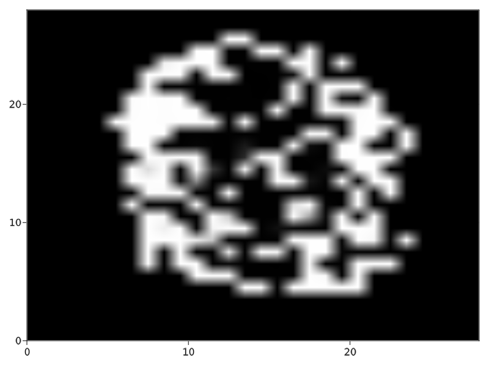

# GAN

This project implements the algorithm found in "Generative Adversarial Networks" - Ian J. Goodfellow, et al. [arXiv:1406.2661](https://github.com/aarontrowbridge/GAN)

## the idea

The goal is to simultaneously train a generator of images similar to that of a given image data set (here I am using MNIST at first) and a discriminator that returns the probability of a given image coming from the distribution of the data set.

This first implementation uses fully connected MLPs to approximate the generator `G` and discriminator `D`.  Hopefully soon I will have a convolutional version up and running.

## models

To set the structure for `G` and `D`, create a list of tuples `[(nodes, activation)]`, specifying the hidden layers of the DNN. I.e.

```julia
# generator layer structure (nodes, activation)
G = [(50,  sigmoid_fast),
     (75,  sigmoid_fast),
     (100, sigmoid_fast),
     (200, sigmoid_fast)]


# generator layer structure (nodes, activation)
D = [(200, sigmoid_fast),
     (100, sigmoid_fast),
     (50,  sigmoid_fast),
     (10,  sigmoid_fast)] 
```

A GAN model can be constructed by supplying a hyper parameter struct, in this case `GANHyperParams <: GANHyperParams`, to create a `GANmodel`: 

```julia
hyper_params = GANHyperParamsMLP(
    img_size,
    G, D,
    d=10, # internal noise vector (representation) dimension
    NoiseDist = Normal()
)

model = GANmodel(hyper_params) 
```

## training the model

A `train!` function is supplied with signature

```julia
function train!(model::GANmodel, data::Vector{Matrix{Float32}}; 
                opt=ADAM(), # optimization method 
                n=1000,     # number of iterations  
                k=1,        # loops per iteration to spend on discriminator 
                m=10)       # minibatch size
```

To test out the algorithm and output and image we can run:

```julia
train!(model, images, n = 5000, k = 10)

gen_img = reshape(
    model.G(rand(model.hps.NoiseDist, model.hps.d)),
    model.hps.data_size
)

using GLMakie

image(gen_img)
```

This outputs the following image (not exactly a digit but we'll get there!):

