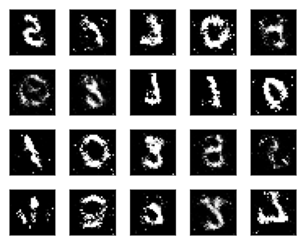

# GAN

This project uses [Flux.jl](https://fluxml.ai/Flux.jl/stable/) to implement the algorithm found in "Generative Adversarial Networks" - Ian J. Goodfellow, et al. [arXiv:1406.2661](https://github.com/aarontrowbridge/GAN)

## the idea

The goal is to simultaneously train a generator of images similar to that of a given image data set (here I am using MNIST at first) and a discriminator that returns the probability of a given image coming from the distribution of the data set.

This first implementation uses fully connected MLPs to approximate the generator `G` and discriminator `D`.  Hopefully soon I will have a convolutional version up and running.

## models

A `GANModel` looks like:

```julia
mutable struct GANModel
    G::Chain
    D::Chain
    hparams::GANHyperParams
end
```

To construct a model just supply any fully connected pair `Chain`s, like so:

```julia
generator = Chain(
    Dense(100, 1200, relu),
    Dense(1200, 1200, relu),
    Dense(1200, img_dim, tanh_fast)
)

discriminator = Chain(
    Maxout(() -> Dense(img_dim, 240), 5),
    Maxout(() -> Dense(240, 240), 5),
    Dense(240, 1)
)
```

and a hyperparameter struct which uses Parameters.jl and defaults to

```julia
@with_kw struct GANHyperParams 
    latent_dim::Int = 100            
    minibatch::Int  = 50
    iterations::Int = 1000
    dscr_loops::Int = 1
    η_dscr::Float32 = 0.002
    η_gen::Float32  = 0.002
end
```


## training the model

A `train!` function is supplied with signature

```julia
train!(model::GANModel, train_tensor::AbstractArray;
       opt=OADAM,
       device=cpu,
       verbose=true, 
       skip=50)
```

## tests

There are a couple test scripts right now:

* mnist_goodfellow.jl
* cifar10_goodfellow.jl

and can be run from the command line using, for example

`julia --project=. mnist_goodfellow.jl <device={gpu,cpu}> <iterations> <skip>`

Here is one output example from the MNIST script:

