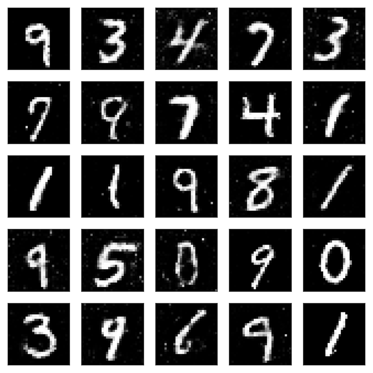
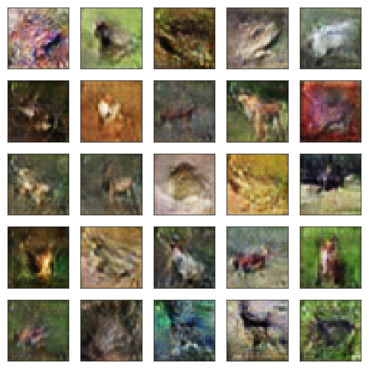

# FluxGAN.jl

This project uses [Flux.jl](https://fluxml.ai/Flux.jl/stable/) to implement Generative Adversarial Networks, an optimization scheme introduced by Ian J. Goodfellow, et al. [arXiv:1406.2661](https://arxiv.org/abs/1406.2661)

## overview 

This package provides a functionality for constructing GANs and training them according to the algorithm in Goodfellow's original paper.  


## models

The `GAN` struct looks like:

```julia
mutable struct GAN
    G::Chain
    D::Chain
    G_opt::AbstractOptimiser
    D_opt::AbstractOptimiser
    hparams::GANHyperParams
end
```

To construct a model just create a pair of Flux.jl's `Chain`s to approximate the generator `G` and discriminator `D`, like so:

```julia
generator = Chain(
    Dense(latent_dim, 1200, relu),
    Dense(1200, 1200, relu),
    Dense(1200, img_dim, tanh_fast)
)

discriminator = Chain(
    Maxout(() -> Dense(img_dim, 240), 5),
    Maxout(() -> Dense(240, 240), 5),
    Dense(240, 1)
)
```

To set 
and a hyperparameter struct which uses Parameters.jl and defaults to

```julia
@with_kw struct GANHyperParams 
    latent_dim::Int = 100            
    dscr_loops::Int = 1
    minibatch::Int  = 50
    η_gen::Float32  = 0.0001f0
    η_dscr::Float32 = 0.0001f0
    img_size::Tuple = undef
end
```


## training the model

A `train!` function is supplied with signature

```julia
train!(model::GAN, train_tensor::AbstractArray; kws...)

```
This function sees if a GPU is available, in which case it calls

```julia
train_gpu!(model::GAN, train_tensor::AbstractArray; 
           iterations=1000, verbose=true, skip=50)
```

If no GPU is available it will just use the cpu via `train_cpu!`, which has the same signature.

The important key words are:

* `iterations`: how many training runs to do
* `verbose`: whether or not to print periodic updates during training
* `skip`: how many iterations to skip in between update messages 

Take a look at the file `src/train.jl` to see how things work; what's great about julia is how readable the source code is!

## tests

There are a few examples available in the `scripts` directory:

* mnist_goodfellow.jl
* cifar10_mlp_goodfellow.jl
* cifar10_conv_goodfellow.jl

These can be run from the command line using, e.g.

`julia --project=. scripts/cifar10_conv_goodfellow.jl <iterations> <minibatch> <skip>`

Here is an output example from the MNIST script:



And here is an output from the convolutional CIFAR10 script:




## utilities

The package exports some additional useful functions for help with converting arrays into images, using Images.jl, and plotting grids of images, using CairoMakie.jl

```julia
color_image(imgtensor::Array)
```

Accepts arrays of dimension 2 or 3 and returns a matrix of `RGB` or `Gray` pixels.

```julia
image_grid(imgs::Array, layout::NamedTuple{(:x, :y), Tuple{Int,Int}};
           img_res = 150, hflip=true)
```
Accepts a tensor of images (e.g. `Array{Float32, 32, 32, 3, n}` for some `n` being the number of images) and named tuple (e.g. `(x=5, y=5)`) specifying the layout of the grid.

```julia
image_grid(model::GAN, output_dir::String;
           layout = (x=5, y=4),
           img_res = 150,
           uncenter = true,
           date = false,
           file_info = [])
```
The only tricky bit here is `file_info`, which just transmits some information to the ultimate file name; one can see use examples in any of the scripts.


## GPU

Training algorithm defaults to GPU if available, if program is quit prematurely, data will remain on GPU, clogging things up.

If GPU memory issue, run `nvidia-smi` from command line, and look for julia processes. If those exist run:

`nvidia-smi | grep 'julia' | awk '{ print $5 }' | xargs -n1 kill -9`

to kill those processes.

## TODO: 

### models
- [x] Goodfellow models
  - [x] MLP MNIST
  - [x] MLP CIFAR-10
  - [x] Convolutional CIFAR-10
- [ ] Conditional GAN
- [ ] Wasserstein GAN
- [ ] Art GAN 

### infrastructure
- [ ] tests
- [ ] loss plotting
- [ ] image sheet plotting
- [ ] performance metrics